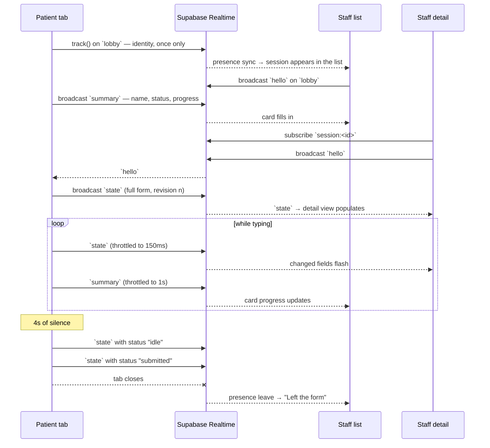

# Development planning documentation

## Project structure

```
src/
├── app/                        Routes only — each page is a thin shell
│   ├── page.tsx                Landing / role chooser
│   ├── form/page.tsx           Mints a session id, redirects to /form/<id>
│   ├── form/[sessionId]/       Patient form
│   ├── staff/page.tsx          Live list of active sessions
│   └── staff/[sessionId]/      One session, field by field
│
├── components/
│   ├── patient/                PatientForm, FormField, SubmittedPanel
│   ├── staff/                  StaffDashboard, SessionCard, SessionDetail, LiveField
│   ├── ui/                     shadcn/ui primitives — generated, not hand-edited
│   ├── DatePicker.tsx          Calendar in a popover, for date of birth
│   ├── MainNav.tsx             Header links, marking the current view
│   ├── SearchableSelect.tsx    Type-to-filter combobox for the long lists
│   ├── SessionGuard.tsx        Warns before navigation ends a live session
│   ├── StatusPill.tsx          Session state as a coloured badge
│   ├── ConnectionBadge.tsx     Realtime connection state
│   ├── ThemeProvider.tsx       next-themes, defaulting to the OS setting
│   ├── ModeToggle.tsx          Light / dark / system switch
│   └── SetupNotice.tsx         Shown when env vars are absent
│
└── lib/
    ├── patient/
    │   ├── options.ts          Choice lists for the selects
    │   ├── schema.ts           Zod schema + field registry (see below)
    │   └── useDraft.ts         localStorage draft persistence
    ├── realtime/
    │   ├── protocol.ts         Channel names, event names, payload types
    │   ├── client.ts           Supabase client singleton
    │   ├── usePatientPublisher.ts   Outbound: everything the patient sends
    │   ├── useLobby.ts              Inbound: who is currently filling in
    │   ├── useSessionMonitor.ts     Inbound: one session's field values
    │   └── useTrailingThrottle.ts   Leading+trailing send rate limiter
    ├── time.ts                 Shared ticking clock for relative timestamps
    └── utils.ts                 cn() — the shadcn class merger
```

Three rules shape the layout:

- **Routes hold no logic.** Every `page.tsx` resolves params, checks
  configuration, and renders one component. This keeps the realtime code out of
  the server/client boundary entirely.
- **Realtime is a library, not a component concern.** Components call a hook and
  get plain values back. No component imports `@supabase/supabase-js`.
- **The form is data, not markup.** `FIELD_META` in `schema.ts` declares every
  field's label, control type, and whether it is optional. The patient form and
  the staff view both render from it, so adding a field means editing one
  object — and the two sides can never disagree about a label or drift apart.

## Design

The interface is built on **shadcn/ui** with a custom preset, installed with:

```bash
npx shadcn@latest apply --preset b311momZs0
```

That preset owns the palette, the radius scale and the typography (DM Sans for
body, Outfit for headings), all as CSS custom properties in `globals.css`. Two
conventions keep it maintainable:

- **Everything above the "Application tokens" divider in `globals.css` belongs
  to the CLI.** Re-running `apply` rewrites it. Anything the app needs that the
  preset has no opinion about — the four session-state colours, the field-flash
  highlight — is declared below the divider and mapped through its own
  `@theme inline` block.
- **`components/ui/` is generated, not authored.** App components compose those
  primitives; they don't fork them.

Dark mode is a `.dark` class rather than a media query, which is what the preset
emits. `next-themes` applies it, defaulting to `system` — so the app still
follows the OS unless the reader picks a side from the header toggle. `:root`
also sets `color-scheme`, so native chrome such as scrollbars follows. Because
the tokens flip rather than the classes, almost no component carries a `dark:`
variant.

**Mobile first.** Patients are on phones in a waiting room; staff are usually at
a desk. The two interfaces are shaped by that difference rather than by one
shared responsive grid:

| | Mobile | Tablet | Desktop |
| --- | --- | --- | --- |
| Patient form | Single column, full-width controls, `sticky` progress bar | Two columns within each section | Capped at `max-w-3xl` — a 1400px-wide form is harder to read, not easier |
| Staff list | One card per row | Two columns | Three columns |
| Staff detail | Sections stacked | Stacked | Two columns, so a whole form fits without scrolling |

Specific decisions:

- **Progress is measured against required fields only.** Counting the optional
  ones would make a complete form read as 85% done and stall the bar near the
  end.
- **Only the long lists are searchable.** Nationality has 53 options and
  language 18, so both are comboboxes; gender, religion and relationship are
  short enough to scan and stay plain selects. `FIELD_META` decides with a
  `searchable` flag, so the choice stays with the field definition rather than
  the markup.
- **Validation waits for blur, then goes live.** `mode: "onBlur"` with
  `reValidateMode: "onChange"` means nobody is told their email is invalid while
  they are still typing the domain, but a correction clears the error
  immediately.
- **A session lives exactly as long as the patient's tab.** Presence is bound to
  that tab's socket, so closing it — or navigating away, including to the staff
  view in the same tab — ends the session for every watcher. Nothing is lost:
  the id is in `sessionStorage` and the answers in `localStorage`, so returning
  to `/form` resumes both. Once the form has anything in it, header links ask
  before navigating and offer to open the destination in a new tab instead, via
  `Link`'s `onNavigate`. The staff list is deliberately a view of what is open
  now rather than a queue, which is what lets the app hold no patient data
  server-side. Persisting to a table would be the change to make if the front
  desk needed to see forms whose patient has stepped away.
- **Only the active status pulses.** An indicator that animates in every state
  stops carrying information.
- **Changed fields flash once** in the staff view, ~1.4s, and the animation is
  replaced by a static outline under `prefers-reduced-motion`.
- **The first message never flashes.** Opening a session mid-form would
  otherwise light up every field at once, which reads as noise rather than as an
  update.
- Touch targets are ≥44px, every input has a real `<label>`, errors are wired up
  with `aria-describedby`, and status changes are announced with `aria-live`.

## Component architecture

```
app/form/[sessionId]                       app/staff                app/staff/[sessionId]
        │                                       │                          │
   PatientForm ──── usePatientPublisher    StaffDashboard ─ useLobby   SessionDetail
        │                                       │                       │        │
    FormField ×13 ─── DatePicker           SessionCard ×N        useSessionMonitor
        │                                                              LiveField ×13
  SubmittedPanel
```

| Component | Purpose |
| --- | --- |
| `PatientForm` | Owns form state (react-hook-form + Zod), subscribes to its own changes and forwards them to the publisher, saves a local draft, and swaps to the confirmation panel on submit. |
| `FormField` | Renders whichever control `FIELD_META` declares — text, date, select, or textarea — with its label, optional marker, and error. There is no per-field JSX anywhere. |
| `SubmittedPanel` | Confirmation plus a read-back of what was sent, with a route back into editing. |
| `StaffDashboard` | The lobby: active session count, connection state, and a card grid. |
| `SessionCard` | One session at a glance — name, status, progress, how long it has been open, last activity. |
| `SessionDetail` | Combines presence and broadcast into a single status, then renders the whole form read-only. |
| `LiveField` | One label/value pair that flashes when its value changes. |
| `DatePicker` | Date of birth: a calendar in a popover, with month and year menus bounded to 1900–today. Values stay `YYYY-MM-DD` strings so the wire format never changes. |
| `SearchableSelect` | Type-to-filter combobox, used where a list is too long to scan. Selection-only: typing narrows the options rather than setting free text, so the value is always one of `options`. |
| `StatusPill` / `ConnectionBadge` | The two indicators, shared by both views. |
| `MainNav` | Header links, marking the current view with `aria-current` and a filled pill. |
| `SessionGuard` | Provider plus `GuardedLink`. Once the form has content, in-app links ask before navigating and offer to open the destination in a new tab, so watching the staff view need not end the session. |

The hooks are the seam. `usePatientPublisher` is everything the patient sends;
`useLobby` and `useSessionMonitor` are everything staff receive. Each returns
plain data, so every component in the tree can be rendered and reasoned about
without a live connection.

## Real-time synchronisation flow

Two channels, deliberately separate.



**`lobby` — Presence *and* broadcast, doing different jobs.** Presence answers
"is this tab still open": each patient tracks `{ sessionId, startedAt }` exactly
once on join and never updates it. Supabase evicts a client's presence when its
socket drops, so a closed tab needs no heartbeat or timeout logic here. The
things that change — name, status, progress — are broadcast as a `summary`
instead. The staff list uses presence as the gate and the summary for detail.

**`session:<id>` — Broadcast.** Carries the actual field values, so form
contents reach only the staff member who opened that session rather than
everyone looking at the list.

### Design decisions

**Full state on every message, not diffs.** The payload is a flat record of
short strings — under a kilobyte even when complete — so sending all of it costs
less than the bookkeeping a diff protocol needs to stay correct. It also
self-heals: a staff tab that misses a message while backgrounded is repaired by
the next one, instead of holding a permanently corrupt merge.

**A `hello` handshake on open.** Broadcast keeps no history, so a staff tab
opening onto a half-filled form would see nothing until the next keystroke. It
announces itself; the patient tab replays its current state immediately.

**Revision numbers, scoped to a mount.** Broadcast does not guarantee ordering,
so each message carries a counter and the staff side drops anything older than
it has applied. The counter restarts at 0 when the patient's tab reloads, which
would leave an open staff view dropping every payload until the patient had made
as many edits again — so each message also carries an `instance` id, and the
staff side resets its counter whenever that changes.

**Two throttle rates.** Field values are throttled to 150ms and presence to 1s,
both leading-edge-plus-trailing: the first keystroke of a burst goes out
immediately, and the last one is never the one that gets dropped. The staff list
only shows a summary, so it does not need keystroke granularity, and the coarser
rate keeps a room full of patients well inside Supabase's per-client event
limit.

**Presence is never used as an update channel.** This one was learned the hard
way: an earlier version re-called `track()` once a second to publish progress,
and cards blinked out of the staff list while patients were still typing.
Re-tracking is an untrack-then-track, and Supabase coalesces rapid presence
updates — so an observer sees the key leave with empty metas and only reappear
on a later diff. Presence now carries identity only. Relatedly, the staff list
rebuilds from `presenceState()` only on the `sync` event, because a `join` or
`leave` handler can observe the state mid-update.

**Nothing arriving is trusted.** The anon key is public, so anyone can join
`session:<id>` and broadcast; a client on an older field set would send something
just as incomplete. The staff side rebuilds values from `PATIENT_FIELDS` and
falls back on an unrecognised status rather than indexing straight into the
payload — the same defensive read `useDraft` does for localStorage.

**Nothing is pushed at a channel that has not joined.** `channel.send()` on a
joining channel does not fail — supabase-js quietly falls back to a REST POST.
Both senders check first and skip, which is safe precisely because messages
carry full state and every hook re-flushes from its `SUBSCRIBED` callback.

**Status is computed by whoever knows best.** The patient tab owns
`filling → idle → submitted`, because only it knows when someone stopped typing.
`disconnected` is inferred by staff from presence. The detail view prefers the
broadcast status while the patient is present (it is ~6× fresher) and falls back
to presence otherwise — with one exception: a submitted form stays "Submitted"
after the tab closes rather than decaying to "Left the form".

### Known scope cuts

**No authentication on the staff view.** Anyone with the URL can watch live
sessions, and Supabase Realtime Authorization is not configured, so any client
holding the anon key can join a session channel. For a real intake system this
is the first thing to add — staff auth plus channel authorization policies — and
it is left out here because the brief asks for the realtime interface rather
than an access-control model.

**Drafts expire after 12 hours.** A patient's answers sit in `localStorage` on
their own device so a refresh does not lose them. A waiting-room device is
shared, so anything older than a visit is dropped on sight rather than kept
indefinitely.

### What is deliberately not persisted

Nothing is stored server-side. Form contents live in the patient's browser and
are relayed through Realtime; closing the tab ends the session and the staff
view says so explicitly. This matches the brief — which asks for real-time
monitoring, not a patient record system — and means no patient data is written
to a database. A patient's own answers survive a refresh via `localStorage` on
their device only.

Adding durable submissions later would mean one Postgres table and an insert on
submit; nothing about the realtime layer would change.
